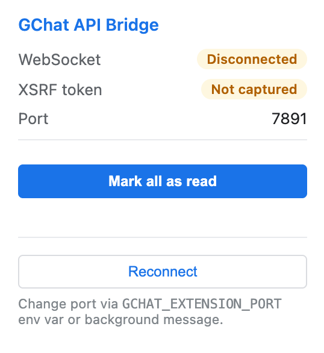

# Google Chat API (Unofficial)

Google Chat doesn't have an official API for personal/consumer accounts. This repo is a reverse‑engineered TypeScript/Node.js client that talks to the same internal endpoints the web app uses (`chat.google.com`) so you can automate your own Chat account locally.

## Features


- **CLI (`gchat`)**
  - Search messages
  - List 
    - spaces
    - DMs
    - threads
    - messages
  - Send 
    - Channel messages
    - Private messages
    - Thread replies
  - Misc
    - Batch data exporter for spaces and DMs
    - Stay online (keep yourself logged online)
    - Browser-based presence (`gchat presence`) via Playwright + storageState
- **Local HTTP API server**
  - JSON endpoints for the same operations as the CLI
  - Web UI at `/ui`
  - API docs (Scalar) at `/docs`
- **TypeScript library**
  - `GoogleChatClient` for programmatic use
  - `utils` for higher-level workflows:
    - `utils.startStayOnline()` – maintain presence via WebChannel + refresh
    - `utils.exportChatBatches()` – cursor-based export batching for large spaces
- **Cookie-based authentication**
  - Uses cookies from an already logged-in browser profile + an XSRF token from `/mole/world`
  - Cache defaults to `~/.gchat` (override with `--cache-dir` or `GCHAT_CACHE_DIR`)
- **Chrome Extension authentication** (default)
  - Routes all API requests through the browser so cookies are never extracted
  - Set `GCHAT_EXTENSION_AUTH=false` to fall back to cookie extraction

## Run Docs

**Project Documentation:**
```bash
npm run dev:docs
```
Access at `http://127.0.0.1:8000`

**OpenAPI Docs**
```bash
npm run dev
```
Access at `http://localhost:3000/docs`

## Run UI

Start the HTTP API server with web interface:

**Development (hot reload):**
```bash
npm run dev
```

**Production:**
```bash
npm run serve
```

**With custom browser or profile:**
```bash
npm run dev -- --browser brave --profile "Profile 5"
```

- UI: `http://localhost:3000/ui`
- API Docs: `http://localhost:3000/docs`

Supported browsers: `chrome`, `brave`, `edge`, `chromium`, `arc`

## Run CLI

Navigate to the CLI package and run commands:

```bash
cd packages/gchat

# Check auth status
npm start -- auth status

# List spaces
npm start -- spaces

# Send a message
npm start -- send <space_id> "Your message"

# Export space (last 7 days)
npm start -- export <space_id> --since 7d --full-threads

# Stay online
npm start -- stay-online
```

**With custom browser or profile:**
```bash
npm start -- --browser brave --profile "Profile 5" spaces
```

Supported browsers: `chrome`, `brave`, `edge`, `chromium`, `arc`

## Chrome Extension Authentication



As an alternative to cookie extraction you can route all API requests through a Chrome extension.  The extension runs inside the browser where you are already logged in to Google Chat, so cookies attach automatically and are never read by Node.js.

### Setup

1. **Load the extension in Chrome**

   Open `chrome://extensions`, enable **Developer mode**, click **Load unpacked**, and select the `extension/` folder in this repo.

2. **Open Google Chat in Chrome**

   Navigate to `https://chat.google.com`.  The extension captures the XSRF token from the page automatically once any Chat request is made.

3. **Set environment variables** (optional — extension auth is on by default)

   ```bash
   # .env (or export in your shell)
   # GCHAT_EXTENSION_PORT=7891   # optional, default is 7891

   # To disable extension auth and use cookie extraction instead:
   # GCHAT_EXTENSION_AUTH=false
   ```

4. **Start the server or CLI**

   ```bash
   npm run dev        # HTTP server
   # or
   npm start -- spaces  # CLI (inside packages/gchat)
   ```

   On startup the bridge server listens on `ws://127.0.0.1:7891`.  The extension connects automatically and the server waits up to 30 seconds for the XSRF token before timing out with a clear error.

### How it works

```
Node.js server / CLI
  └─ ExtensionBridge (WebSocket server :7891)
       └─ Chrome extension (background.js)
            └─ content.js → interceptor.js (in Google Chat page context)
                 └─ Outbound fetch with session cookies attached by browser
```

- `interceptor.js` monkey-patches `fetch`/`XHR` on `chat.google.com` to capture the `x-framework-xsrf-token` header and to serve as an in-page API proxy.
- `content.js` relays the XSRF token and API requests between the background service worker and the page.
- `background.js` maintains the WebSocket connection to the bridge and forwards API requests/responses.

### Extension popup

Click the extension icon in Chrome to see:
- WebSocket connection status
- Whether the XSRF token has been captured
- Current bridge port
- A **Reconnect** button if the connection drops

### Troubleshooting

| Symptom | Fix |
|---|---|
| `Extension not connected` error | Load the extension in Chrome and open Google Chat, or set `GCHAT_EXTENSION_AUTH=false` to use cookie auth |
| `Timed out waiting for XSRF token` | Open or reload `https://chat.google.com` so the extension can capture the token |
| Port conflict | Set `GCHAT_EXTENSION_PORT` to a different port and reload the extension |
| Want to use cookie auth instead | Set `GCHAT_EXTENSION_AUTH=false` in your `.env` |

---

Disclaimer: this uses unofficial/internal Google APIs. Endpoints and auth can change without notice.
